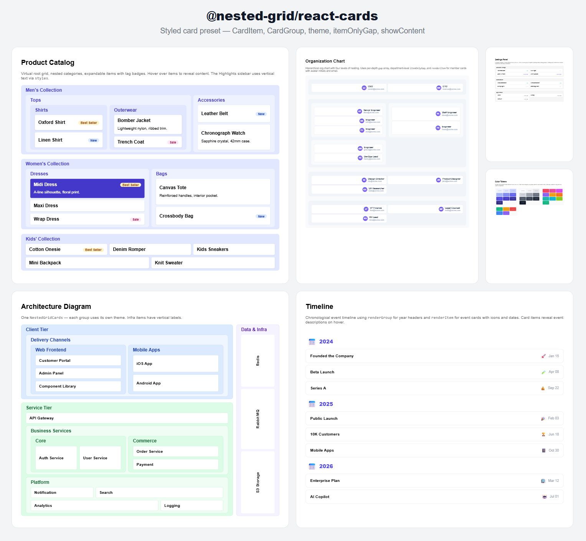

# @nested-grid/react-cards

**JSON 驱动 CSS Grid 布局的带皮肤卡片 UI。**

把布局描述为一棵普通对象树 —— `columns`、`span`、`gap`。引入 `<NestedGridCards>`，即刻得到嵌套 CSS Grid 中带样式的 `<CardGroup>` / `<CardItem>` 卡片，含标题、hover 状态、可展开内容，以及 30 个 CSS 自定义属性的主题系统。零 CSS 手写，完全可主题化。

适用于产品目录、设置面板、组织架构图、架构图、色彩 Token 面板、时间线 —— 任何该用卡片展示的层级数据。



> **底层引擎：** [`@nested-grid/core`](https://www.npmjs.com/package/@nested-grid/core) — 零依赖布局引擎，从树数据计算 CSS Grid 样式。  
> **无头替代：** [`@nested-grid/react`](https://www.npmjs.com/package/@nested-grid/react) — 相同布局引擎，但你通过 `renderItem` / `renderGroup` / `renderNode` 自行控制所有样式。如需掌控每个像素，选它。

## 安装

```bash
pnpm add @nested-grid/react-cards
```

引入 CSS：

```ts
import "@nested-grid/react-cards/styles.css";
```

## 快速开始

```tsx
import { NestedGridCards } from "@nested-grid/react-cards";
import "@nested-grid/react-cards/styles.css";

const nodes = [
  {
    id: "fruits",
    data: { title: "水果" },
    children: [
      { id: "apple", data: { title: "苹果" } },
      { id: "banana", data: { title: "香蕉" } },
    ],
  },
];

function App() {
  return <NestedGridCards nodes={nodes} gap="12px" />;
}
```

## API

### `<NestedGridCards>`

继承 `<NestedGrid>` 的所有 props。额外属性：

| 属性 | 类型 | 说明 |
|---|---|---|
| `theme?` | `CardTheme` | 卡片主题覆盖 |
| `showContent?` | `boolean` | 是否默认展开所有 item 内容 |
| `itemOnlyGap?` | `string \| string[]` | 仅对子节点全为 item 的 group 生效的间距。用途：叶子 group 内部间距更紧凑 |

### `<CardItem>`

带样式的 item 卡片。参数：

| 属性 | 类型 | 说明 |
|---|---|---|
| `node` | `LayoutNode<T>` | 布局节点 |
| `showContent?` | `boolean` | 展开内容体 |
| `styles?` | `CardStyles` | 样式覆盖：`header` 和 `body` CSS 属性 |
| `titleExtra?` | `(state: { expanded: boolean }) => ReactNode` | 标题行附加元素（标签、徽章、开关） |

### `<CardGroup>`

带样式的 group 卡片。参数：

| 属性 | 类型 | 说明 |
|---|---|---|
| `node` | `LayoutNode<T>` | 布局节点 |
| `children` | `ReactNode` | 预渲染的子节点 |

### `CardTheme`

| 字段 | 默认值 | 说明 |
|---|---|---|
| `groupBg` / `groupBgEven` / `groupBgOdd` | — | Group 背景色（按深度交替） |
| `groupBorder` | — | Group 边框 |
| `groupBorderRadius` | — | Group 圆角 |
| `groupTitleColor` | — | Group 标题文字颜色 |
| `groupTitleFontSize` / `groupTitleFontWeight` | — | Group 标题排版 |
| `groupPadding` / `groupHeaderPadding` / `groupBodyPadding` | — | Group 间距 |
| `itemBg` | — | Item 背景 |
| `itemBorder` | — | Item 边框 |
| `itemBorderRadius` | — | Item 圆角 |
| `itemShadow` | — | Item 阴影 |
| `itemPadding` | — | Item 内边距 |
| `itemHoverBg` / `itemHoverColor` | — | Item hover 状态 |
| `itemTitleFontSize` / `itemTitleFontWeight` | — | Item 标题排版 |
| `contentColor` / `contentFontSize` / `contentLineHeight` | — | 可展开内容体 |
| `contentPaddingTop` | — | 内容顶部间距 |
| `contentAnimDuration` | — | 展开/收起动画时长 |

### `themeToVars(theme?)`

将 `CardTheme` 对象转换为 CSS 自定义属性覆盖。由 `NestedGridCards` 内部使用。

```ts
import { themeToVars } from '@nested-grid/react-cards'

<div style={themeToVars({ groupTitleColor: '#4338ca' })}>
  <NestedGridCards nodes={nodes} />
</div>
```

## itemOnlyGap

当 group 只包含 item（无嵌套 group）时，`itemOnlyGap` 覆盖默认间距。以此营造视觉层级——兄弟 group 间距大，组内 item 间距小。

```tsx
<NestedGridCards
  nodes={nodes}
  gap="16px"       // group 之间的间距
  itemOnlyGap="4px" // 叶子 group 内部 item 间距
/>
```

同样支持按深度数组：

```tsx
<NestedGridCards
  nodes={nodes}
  gap={["16px", "12px"]}
  itemOnlyGap={["6px", "4px"]}
/>
```

## 更多示例

[examples 目录](https://github.com/XDXXDXXDXXDXXDX/nested-grid/tree/main/examples/src) 中有 15+ 真实布局示例 —— 定价表、看板、杂志布局、组织架构图、照片墙、色彩面板等。每个不超过 100 行。

## License

MIT
