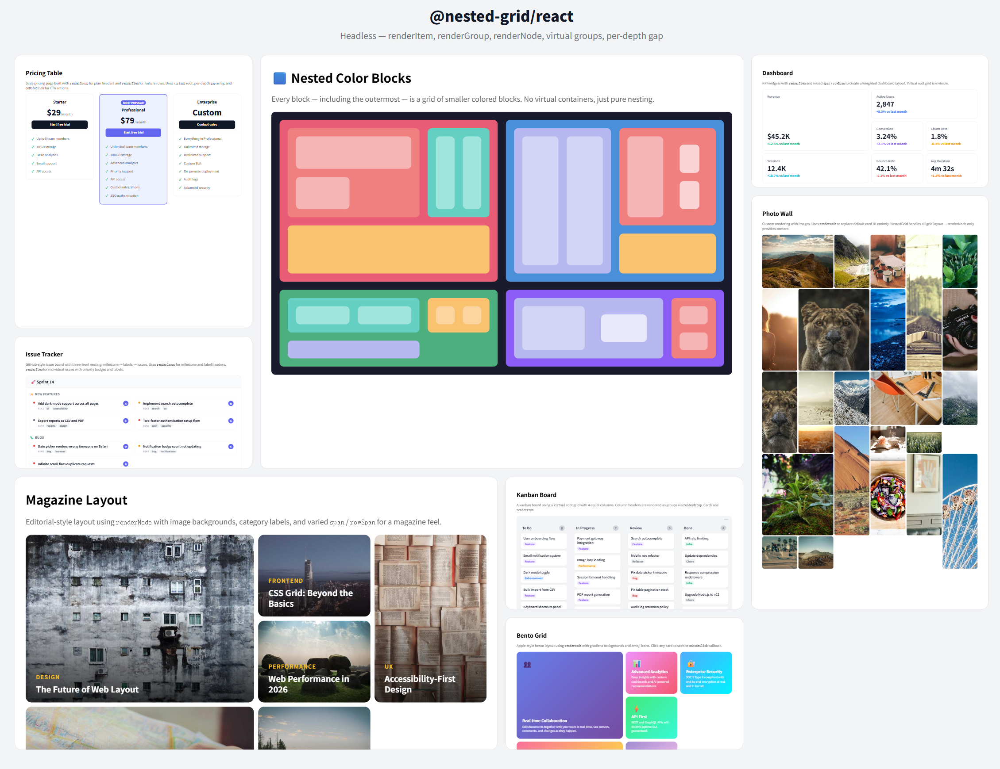

# @nested-grid/react

**React renderer for JSON-driven CSS Grid layouts. Headless — you own every pixel.**

Pass a tree of grid nodes. Get back nested `<div>`s with computed `display: grid`, `grid-template-columns`, and `grid-column: span N` styles. Three render props (`renderItem`, `renderGroup`, `renderNode`) let you inject any UI while the library handles all layout.



> **Layout engine:** [`@nested-grid/core`](https://www.npmjs.com/package/@nested-grid/core) — zero-dependency, framework-agnostic engine that computes CSS Grid styles from tree data.  
> **Styled preset:** [`@nested-grid/react-cards`](https://www.npmjs.com/package/@nested-grid/react-cards) — drop-in `<CardGroup>` / `<CardItem>` components with a 30-token theme system. Use this if you want styled cards without writing CSS.

## Install

```bash
pnpm add @nested-grid/react
```

Requires `react >= 18.0.0` and `@nested-grid/core`.

## Quick Start

```tsx
import { NestedGrid } from "@nested-grid/react";
import type { GridNode } from "@nested-grid/core";

const nodes: GridNode[] = [
  {
    id: "root",
    columns: 3,
    children: [
      { id: "a", data: { title: "Item A" }, span: 2 },
      { id: "b", data: { title: "Item B" } },
      {
        id: "c",
        data: { title: "Nested" },
        children: [
          { id: "c1", data: { title: "Sub 1" } },
          { id: "c2", data: { title: "Sub 2" } },
        ],
      },
    ],
  },
];

export function App() {
  return (
    <NestedGrid
      nodes={nodes}
      gap="12px"
      renderItem={({ node }) => <article>{node.data.title}</article>}
    />
  );
}
```

## API

### `<NestedGrid>`

| Prop              | Type                                        | Description                                                                                             |
| ----------------- | ------------------------------------------- | ------------------------------------------------------------------------------------------------------- |
| `nodes`           | `GridNode<T>[]`                             | Tree data                                                                                               |
| `defaultColumns?` | `number \| string`                          | Default columns for groups without explicit `columns`                                                   |
| `gap?`            | `string \| string[]`                        | Gap for grid containers. Array values map to depth (last value repeats).                                |
| `renderItem?`     | `(props: RenderItemProps<T>) => ReactNode`  | Render an item node                                                                                     |
| `renderGroup?`    | `(props: RenderGroupProps<T>) => ReactNode` | Render a group node (receives pre-rendered `children`)                                                  |
| `renderNode?`     | `(props: RenderNodeProps<T>) => ReactNode`  | Wraps every node after `renderItem`/`renderGroup`. `oriNode` is the result of the type-specific render. |
| `onNodeClick?`    | `(node: LayoutNode<T>) => void`             | Click handler for any node                                                                              |

All `HTMLAttributes<HTMLDivElement>` props are also accepted and spread onto the root element.

### Render callbacks

All render callbacks receive `node` (the resolved `LayoutNode`), `depth`, `index`, and `oriNode` (the default render output). `renderGroup` and `renderNode` also receive pre-rendered `children`.

```tsx
// Just items
<NestedGrid nodes={nodes} renderItem={({ node }) => <Card data={node.data} />} />

// Groups with custom chrome
<NestedGrid
  nodes={nodes}
  renderGroup={({ node, children }) => (
    <section>
      <h2>{node.data.title}</h2>
      {children}
    </section>
  )}
/>

// Wrap every node
<NestedGrid
  nodes={nodes}
  renderNode={({ node, children, oriNode }) => (
    <div onClick={() => track(node.id)}>{oriNode}</div>
  )}
/>
```

### Per-depth gap

```tsx
<NestedGrid
  nodes={nodes}
  gap={["16px", "12px", "8px"]}
  // depth 0 → 16px, depth 1 → 12px, depth 2+ → 8px
/>
```

## HTML output

Each node renders a `<div>` with computed grid styles and data attributes:

```html
<div class="rng-root">
  <div
    class="rng-node rng-node-group rng-depth-0 rng-depth-even"
    data-id="root"
    style="display:grid; grid-template-columns:repeat(3, minmax(0, 1fr)); gap:12px;"
  >
    <div
      class="rng-node rng-node-item rng-depth-1 rng-depth-odd"
      data-id="a"
      style="grid-column:span 2;"
    ></div>
    …
  </div>
</div>
```

Group nodes get `display: grid` in their `gridContainerStyle`. Style with plain CSS, Tailwind, CSS Modules, or any design system.

## More examples

15+ real-world layouts in the [examples directory](https://github.com/XDXXDXXDXXDXXDX/nested-grid/tree/main/examples/src) — dashboard, kanban board, bento grid, magazine layout, photo wall, issue tracker, and more. Each under 100 lines.

## License

MIT
